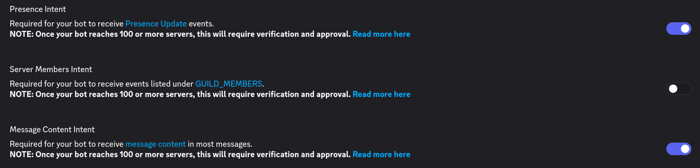

# minecraft-status-bot
A modular status bot that checks for if a server is up, shows stats abt it, and is configurable from a file or commands

## Set-up

No matter how you decide to host the bot, a few bits of basic settup are needed. They are explained below

Discord Token - You get this from the discord developer portal.

The bot also needs the the intents `Presence Intent` and `Message Content Intent`

The bot will also need to have its default install settings, `scopes` and `permissions`

The required `scopes` 
 - `applications.commands`
 - `bot`

The required `permissions`
 - `Read Message History`
 - `Send Messages`

### Docker

For the docker container, you can set up the 

### Uncontainered
